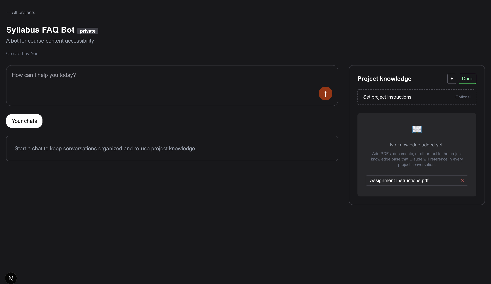

# Project Name

A Next.js application for project management with integrated chat functionality.




## Overview

This application provides a platform for managing projects and facilitating communication through chat interfaces. Built with Next.js and TypeScript, it follows modern web development practices and architecture.

## Project Structure

```
.
├── .next                   # Next.js build output
├── .venv                   # Python virtual environment
├── data                    # Data storage and management
├── node_modules           # Node.js dependencies
├── public                 # Static files
├── src                    # Source code
│   ├── app                # Next.js app directory structure
│   │   ├── [projectId]    # Dynamic project routes
│   │   │   └── [chatId]   # Dynamic chat routes
│   │   └── api            # API routes
│   │       └── upload     # File upload functionality
│   ├── components         # Reusable React components
│   │   ├── ChatInput.tsx
│   │   ├── ChatMessageCard.tsx
│   │   ├── ChatPreviewCard.tsx
│   │   ├── ProjectHeader.tsx
│   │   └── ProjectKnowledge.tsx
│   └── lib                # Utility functions and libraries
│       └── chroma.ts      # Integration with Chroma DB
├── .gitignore             # Git ignore file
├── chroma_script.py       # Python script for Chroma DB operations
├── chroma.log             # Logs for Chroma operations
├── eslint.config.mjs      # ESLint configuration
├── next-env.d.ts          # TypeScript definitions for Next.js
├── next.config.ts         # Next.js configuration
├── package-lock.json      # NPM lock file
└── package.json           # Project dependencies and scripts
```

## Features

- **Project Management**: Create and manage projects
- **Chat Interface**: Real-time chat functionality within projects
- **File Upload**: Support for file uploads
- **Vector Database**: Integration with Chroma DB for knowledge storage and retrieval

## Tech Stack

- **Frontend**: Next.js, React, TypeScript
- **Styling**: CSS (global styles)
- **Database**: Chroma DB (vector database)
- **APIs**: RESTful API endpoints

## Getting Started

### Prerequisites

- Node.js (v16 or later)
- Python (v3.8 or later)
- npm or yarn

### Installation

1. Clone the repository
   ```bash
   git clone [repository-url]
   cd [project-directory]
   ```

2. Install JavaScript dependencies
   ```bash
   npm install
   # or
   yarn
   ```

3. Set up Python environment
   ```bash
   python -m venv .venv
   source .venv/bin/activate  # On Windows, use `.venv\Scripts\activate`
   pip install -r requirements.txt
   ```

4. Configure environment variables
   ```bash
   cp .env.example .env.local
   # Edit .env.local with your configuration
   ```

5. Run development server
   ```bash
   npm run dev
   # or
   yarn dev
   ```

6. Open [http://localhost:3000](http://localhost:3000) in your browser

## Development

### File Structure Conventions

- React components are stored in `src/components/`
- API routes are defined in `src/app/api/`
- Page routes follow Next.js App Router convention in `src/app/`
- Utility functions are placed in `src/lib/`

### Scripts

- `npm run dev`: Start development server
- `npm run build`: Build the application
- `npm start`: Start production server
- `npm run lint`: Run ESLint

## Deployment

The application can be deployed using Vercel, Netlify, or any other platform that supports Next.js applications.

```bash
npm run build
npm start
```

## Contributing

1. Fork the repository
2. Create your feature branch (`git checkout -b feature/amazing-feature`)
3. Commit your changes (`git commit -m 'Add some amazing feature'`)
4. Push to the branch (`git push origin feature/amazing-feature`)
5. Open a Pull Request


